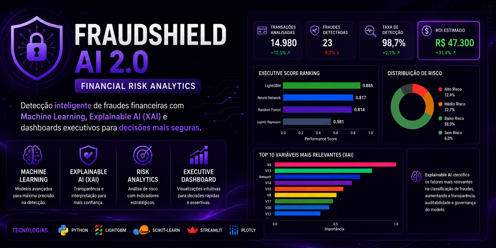

<p align="center">
  
</p>

# 🛡️ FraudShield AI 2.0

> **Financial Risk Analytics with Machine Learning & Explainable AI**

Plataforma inteligente para detecção de fraudes financeiras que integra **Machine Learning**, **Explainable AI (XAI)**, **Risk Analytics** e **Business Intelligence**, transformando dados em apoio à tomada de decisão.

---

# 🎥 Demonstração

📺 **Assista à apresentação do projeto (3 minutos):**

https://youtu.be/tSgUv0Sp93o

---

# 📓 Notebook Google Colab

O desenvolvimento e os experimentos do modelo também podem ser explorados no Google Colab.

🔗 https://colab.research.google.com/drive/11UPQ7GKEBcStHGm1Ee5-bAqYV89Ami-w?usp=sharing

---

# 📌 Sobre o Projeto

O **FraudShield AI 2.0** foi desenvolvido para simular um ambiente corporativo de detecção de fraudes financeiras, demonstrando como Ciência de Dados e Inteligência Artificial podem apoiar decisões estratégicas em bancos, fintechs e empresas de meios de pagamento.

Além da construção dos modelos de Machine Learning, a solução incorpora indicadores financeiros, dashboards executivos e técnicas de Explainable AI (XAI), permitindo interpretar o comportamento dos modelos e traduzir resultados técnicos em impacto para o negócio.

Mais do que identificar transações suspeitas, o projeto demonstra como dados podem ser utilizados para reduzir riscos, aumentar a eficiência operacional e apoiar decisões baseadas em evidências.

---

# 🎯 Problema de Negócio

Fraudes financeiras geram bilhões de reais em perdas todos os anos e representam um dos maiores desafios para instituições financeiras.

Além da identificação de transações fraudulentas, essas organizações precisam equilibrar diferentes fatores, como precisão do modelo, redução de falsos positivos, transparência das decisões e retorno financeiro da solução.

O **FraudShield AI 2.0** foi desenvolvido para demonstrar como Machine Learning pode apoiar esse processo de forma inteligente, interpretável e orientada ao negócio.

---

# ⭐ Por que este projeto é relevante?

Grande parte dos projetos de Machine Learning concentra-se apenas no treinamento e comparação de modelos.

O **FraudShield AI 2.0** vai além, integrando análise preditiva, interpretabilidade dos modelos, indicadores financeiros e dashboards executivos para simular um cenário próximo ao encontrado em instituições financeiras.

O projeto reúne conhecimentos em:

- 🤖 Machine Learning
- 🔍 Explainable AI (XAI)
- 📊 Risk Analytics
- 💰 Financial Analytics
- 📈 Business Intelligence
- 📉 Model Evaluation
- 📋 Data Visualization
- ⚙️ Streamlit

Mais do que construir modelos preditivos, o projeto demonstra como Inteligência Artificial pode gerar valor real para o negócio.

---

# 🏗️ Arquitetura da Solução

```text
                 Dados de Transações
                         │
                         ▼
          Limpeza e Preparação dos Dados
                         │
                         ▼
          Balanceamento das Classes (SMOTE)
                         │
                         ▼
      Treinamento de Modelos de Machine Learning
                         │
                         ▼
              Avaliação e Comparação
                         │
                         ▼
             Explainable AI (SHAP/XAI)
                         │
                         ▼
        Indicadores Financeiros e ROI
                         │
                         ▼
            Dashboard Executivo Streamlit
```

---

# 🚀 Principais Funcionalidades

- 🛡️ Detecção automática de fraudes financeiras
- 🤖 Comparação entre diferentes algoritmos de Machine Learning
- 📊 Dashboard executivo para análise dos resultados
- 🔍 Explainable AI (XAI) para interpretação das decisões dos modelos
- 📈 Indicadores de performance e gestão de risco
- 💰 Estimativa de perdas evitadas e ROI da solução
- ⚖️ Avaliação financeira da implementação da IA
- 📋 Comparação automática entre modelos utilizando métricas técnicas e de negócio

---

# 🧠 Modelos Utilizados

| Modelo | Objetivo |
|---------|----------|
| Logistic Regression | Modelo baseline interpretável |
| Random Forest | Ensemble baseado em árvores |
| LightGBM | Gradient Boosting de alta performance |
| Multilayer Perceptron (MLP) | Rede neural para padrões complexos |

---

# 🛠️ Tecnologias Utilizadas

| Categoria | Tecnologias |
|-----------|-------------|
| Linguagem | Python |
| Machine Learning | Scikit-Learn • LightGBM |
| Balanceamento | SMOTE (Imbalanced-Learn) |
| Manipulação de Dados | Pandas • NumPy |
| Visualização | Matplotlib |
| Dashboard | Streamlit |
| Explainable AI | SHAP |
| Ambiente | Google Colab |

---

# 💼 Competências Demonstradas

Durante o desenvolvimento deste projeto foram aplicados conhecimentos em:

- 📊 Data Analytics
- 🤖 Machine Learning
- 🔍 Explainable AI (XAI)
- 💰 Financial Risk Analytics
- 📈 Business Intelligence
- 📋 Data Visualization
- ⚖️ Model Evaluation
- 🧮 Engenharia de Features
- ⚙️ Desenvolvimento de Dashboards com Streamlit
- 🎯 Data-Driven Decision Making

---

# 💰 Impacto de Negócio

Além da avaliação técnica dos modelos, a plataforma traduz os resultados em indicadores financeiros que apoiam decisões estratégicas.

| Indicador | Resultado |
|-----------|-----------:|
| 💵 Perdas financeiras evitadas | **R$ 47.500** |
| ⚖️ Exposição residual ao risco | **R$ 15.000** |
| 📉 Custo operacional da solução | **R$ 200** |
| 🚀 ROI estimado | **R$ 47.300** |

Esses indicadores demonstram como modelos de Machine Learning podem gerar valor financeiro ao reduzir perdas, otimizar processos e apoiar decisões orientadas por dados.

---

# 📊 Pipeline da Solução

```text
Coleta dos Dados
        │
        ▼
Pré-processamento
        │
        ▼
Balanceamento (SMOTE)
        │
        ▼
Treinamento dos Modelos
        │
        ▼
Avaliação de Performance
        │
        ▼
Explainable AI (SHAP)
        │
        ▼
Business Analytics
        │
        ▼
Dashboard Executivo
```

---

# 📂 Estrutura do Projeto

```text
FraudShield-AI-2.0/
│
├── assets/
├── src/
├── data/
├── app.py
├── requirements.txt
└── README.md
```

---

# ▶️ Como Executar

Clone o repositório:

```bash
git clone https://github.com/BARBARANFS/FraudShield-AI-2.0.git
```

Entre na pasta:

```bash
cd FraudShield-AI-2.0
```

Instale as dependências:

```bash
pip install -r requirements.txt
```

Execute a aplicação:

```bash
streamlit run app.py
```

---

# 📸 Dashboards

## 📊 Executive Dashboard


---

## 📈 Analytics


---

## ⚖️ Risk Management


---

## 🔍 Explainable AI (XAI)


---

## 🏆 Model Performance


---

# 🎓 Contexto

Projeto desenvolvido como entrega final do **Bootcamp Python AI Backend Developer**, promovido pela **Digital Innovation One (DIO)** em parceria com a **Accenture Brasil**.

A solução aplica conceitos de Ciência de Dados, Machine Learning e Inteligência Artificial em um cenário de detecção de fraudes financeiras inspirado em desafios reais do mercado.

---

# 🌐 Papel no Ecossistema

O **FraudShield AI 2.0** representa a etapa final do ecossistema de soluções desenvolvido neste portfólio.

```text
📘 MiniGuia SFN Investimentos
          │
          ▼
 Engenharia de Conhecimento
          │
          ▼
💙 BIA Academy Finance
          │
          ▼
 IA Generativa + RAG
          │
          ▼
🎙️ VoxAI
          │
          ▼
 IA Conversacional
          │
          ▼
🛡️ FraudShield AI 2.0
          │
          ▼
 Financial Risk Analytics
```

Cada projeto complementa o anterior, demonstrando a evolução da Engenharia de Conhecimento para aplicações de IA Generativa, IA Conversacional e Machine Learning aplicado à tomada de decisão.

---

# 🔮 Próximos Passos

- Integração com APIs bancárias
- Detecção de fraudes em tempo real
- Monitoramento contínuo dos modelos
- Deploy em ambiente cloud
- MLOps para versionamento e monitoramento
- Novos algoritmos de detecção de anomalias

---

# 👩‍💻 Autora

**Barbara Freitas**

📊 Data Analytics • Machine Learning • Generative AI • Financial Intelligence

🔗 **GitHub**  
https://github.com/BARBARANFS

🔗 **LinkedIn**  
https://www.linkedin.com/in/barbarafreitas-dataanalytics

---

<div align="center">

⭐ Se este projeto foi interessante para você, considere deixar uma estrela no repositório.

</div>
